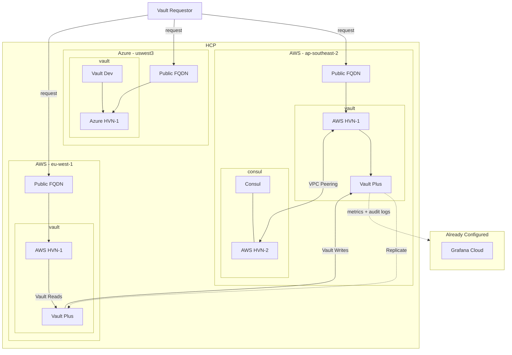

# HCP Cluster Deployment

This repository contains terraform code that deploys various HCP services.

Currently it deploys the following:

- HCP Vault Plus in AWS region `ap-southeast2`
- HCP Consul in AWS region `ap-southeast2`
- HCP Vault Dev in Azure region `westus2`

It will also configure to [forward metrics and telemetry](https://developer.hashicorp.com/vault/tutorials/cloud-monitoring/vault-audit-log-grafana) from the HCP Vault Plus cluster in AWS to a pre-configured Grafana Cloud deployment.
## Topology

